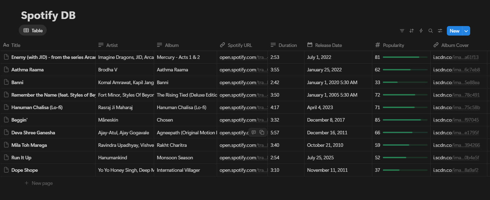
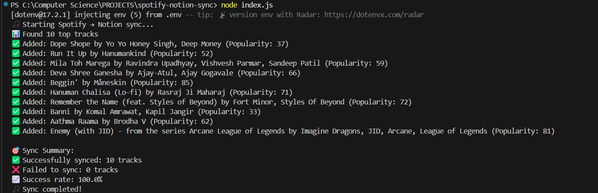
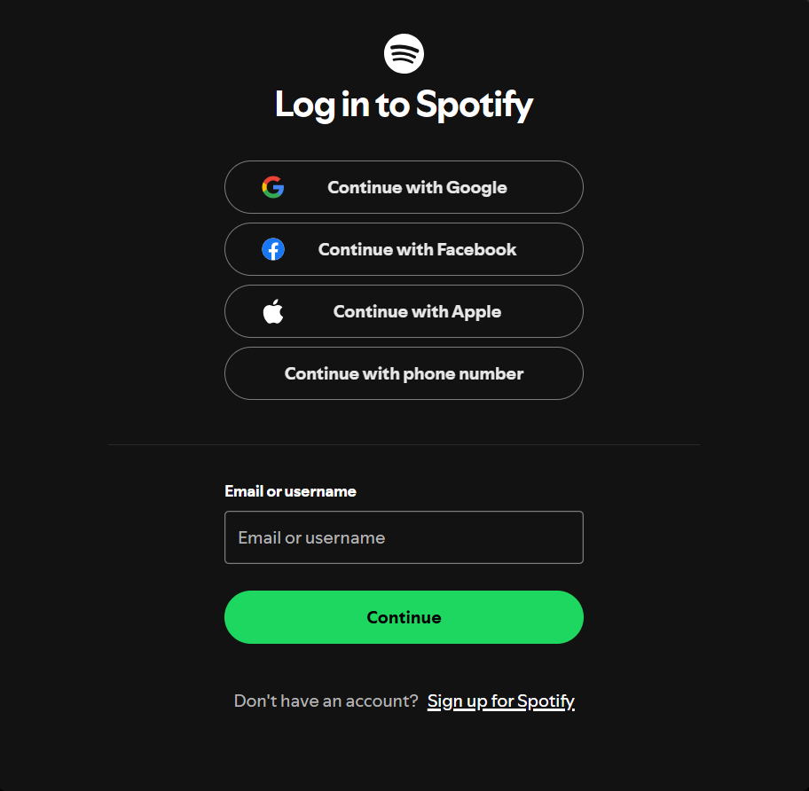

# **🎵 Spotify Notion Sync** → 📒

A powerful **Node.js automation tool** that seamlessly syncs your **Spotify listening data** into a **Notion database** with rich metadata including track details, album artwork, and listening analytics.

Built as a privacy-first data integration solution that keeps your music data under your control while providing powerful organization and tracking capabilities.

---

## **✨ Features**

### **🎯 Core Functionality**
* 🎵 **Smart Track Sync** - Fetches your top Spotify tracks with comprehensive metadata
* 📊 **Rich Data Storage** - Stores track name, artist(s), album, duration, popularity, and more
* 🖼️ **Album Artwork** - Automatically captures and stores album cover URLs
* 🔗 **Direct Links** - Clickable Spotify URLs for instant playback
* 📅 **Timestamp Tracking** - Records when each track was synced
* 🔄 **Duplicate Prevention** - Smart handling to avoid duplicate entries

### **🔒 Privacy & Security**
* **Privacy-First Design** - No external databases, data stays in your Notion workspace
* **Secure Authentication** - OAuth 2.0 with refresh tokens for Spotify
* **Environment Variables** - All sensitive data stored securely in `.env`
* **Local Processing** - Everything runs on your machine

### **⚡ Performance**
* **Efficient API Usage** - Optimized requests with proper rate limiting
* **Error Handling** - Robust error management with detailed logging
* **Batch Processing** - Handles multiple tracks efficiently

---

## **🛠 Tech Stack**

| Technology | Purpose | Version |
|------------|---------|---------|
| **Node.js** | Runtime Environment | 18+ |
| **Axios** | HTTP Client | ^1.6.0 |
| **Express** | Web Server (Auth) | ^4.18.2 |
| **dotenv** | Environment Variables | ^16.3.1 |
| **Spotify Web API** | Music Data Source | v1 |
| **Notion API** | Database Integration | 2022-06-28 |

---

## **📊 Data Schema**

Your Notion database will contain the following properties:

| Property | Type | Description | Example |
|----------|------|-------------|---------|
| **Title** | Title | Track name | "Bohemian Rhapsody" |
| **Artist** | Text | Artist name(s) | "Queen" |
| **Album** | Text | Album name | "A Night at the Opera" |
| **Spotify URL** | URL | Direct Spotify link | `spotify:track:...` |
| **Duration** | Text | Track length | "5:55" |
| **Release Date** | Date | Album release date | 1975-11-21 |
| **Popularity** | Number | Spotify popularity score | 85 |
| **Album Cover** | URL | Album artwork URL | `https://...` |

---

## **🚀 Quick Start**

### **Prerequisites**
- Node.js 18+ installed
- Spotify account (free or premium)
- Notion account with workspace access

### **1. Clone & Install**
```bash
git clone https://github.com/Flames004/spotify-notion-sync.git
cd spotify-notion-sync
npm install
```

### **2. Set Up APIs**

#### **Spotify Setup:**
1. Go to [Spotify Developer Dashboard](https://developer.spotify.com/dashboard)
2. Create new app with redirect URI: `http://127.0.0.1:8888/callback`
3. Copy Client ID and Client Secret

#### **Notion Setup:**
1. Go to [Notion Integrations](https://www.notion.so/my-integrations)
2. Create new integration and copy the token
3. Create a database with the properties listed above
4. Share database with your integration

### **3. Get Spotify Refresh Token**
```bash
node auth.js
# Visit http://127.0.0.1:8888/login
# Copy the refresh token from terminal
```

### **4. Configure Environment**
Create `.env` file:
```env
SPOTIFY_CLIENT_ID=your_spotify_client_id
SPOTIFY_CLIENT_SECRET=your_spotify_client_secret
SPOTIFY_REFRESH_TOKEN=your_refresh_token_from_auth
NOTION_TOKEN=secret_your_notion_integration_token
NOTION_DATABASE_ID=your_notion_database_id
```

### **5. Run the Sync**
```bash
node index.js
```

---

## **📱 Usage Examples**

### **Basic Sync**
```bash
# Sync your top 10 tracks
node index.js
```

### **Advanced Usage** (Future Features)
```bash
# Sync with custom limit
node index.js --limit 50

# Sync recently played tracks
node index.js --type recent

# Schedule daily sync
npm run schedule
```

---

## **🔧 Configuration Options**

### **Environment Variables**
| Variable | Required | Description |
|----------|----------|-------------|
| `SPOTIFY_CLIENT_ID` | ✅ | Your Spotify app client ID |
| `SPOTIFY_CLIENT_SECRET` | ✅ | Your Spotify app client secret |
| `SPOTIFY_REFRESH_TOKEN` | ✅ | OAuth refresh token for API access |
| `NOTION_TOKEN` | ✅ | Notion integration secret token |
| `NOTION_DATABASE_ID` | ✅ | Target Notion database ID |

### **Customizable Settings** (in code)
```javascript
// Number of tracks to fetch (max 50)
const TRACK_LIMIT = 10;

// Time range for top tracks
const TIME_RANGE = 'medium_term'; // short_term, medium_term, long_term

// Spotify scopes
const SCOPES = 'user-top-read user-read-recently-played';
```

---

## **🔐 Security & Authentication**

### **Spotify OAuth Flow**
1. **Authorization Code** - User grants permission via browser
2. **Access Token** - Short-lived token for API requests
3. **Refresh Token** - Long-lived token to get new access tokens
4. **Automatic Refresh** - App automatically refreshes expired tokens

### **Notion Integration**
- **Internal Integration** - Scoped to your workspace only
- **Database Permissions** - Read/write access to specific database
- **No User Data** - Integration cannot access personal Notion content

### **Best Practices Implemented**
- ✅ Environment variables for secrets
- ✅ Explicit loopback addresses (`127.0.0.1`)
- ✅ Proper error handling and logging
- ✅ Rate limiting compliance
- ✅ Minimal required scopes

---

## **📈 Monitoring & Logs**

The application provides detailed console output:

```
📊 Found 10 top tracks
✅ Added: Bohemian Rhapsody by Queen
✅ Added: Stairway to Heaven by Led Zeppelin
❌ Error adding Song Name: Rate limit exceeded
🎵 Sync completed! (8/10 tracks synced)
```

---

## **🚧 Roadmap & Future Enhancements**

### **v2.0 Planned Features**
- [ ] **Automated Scheduling** with `node-cron`
- [ ] **Multiple Playlists** support
- [ ] **Recently Played** tracks sync
- [ ] **Listening History** analytics
- [ ] **Genre Classification** with audio features
- [ ] **Web Dashboard** for configuration
- [ ] **Docker Support** for easy deployment

### **v3.0 Ideas**
- [ ] **Multi-Account Support** for families/teams
- [ ] **Custom Filters** (genre, year, popularity)
- [ ] **Slack/Discord Notifications**
- [ ] **Export Options** (CSV, JSON)
- [ ] **Advanced Analytics** dashboard

---

## **🤝 Contributing**

We welcome contributions! Here's how to get started:

1. **Fork the repository**
2. **Create a feature branch** (`git checkout -b feature/amazing-feature`)
3. **Commit your changes** (`git commit -m 'Add amazing feature'`)
4. **Push to the branch** (`git push origin feature/amazing-feature`)
5. **Open a Pull Request**

### **Development Setup**
```bash
# Install dev dependencies
npm install --dev

# Run in development mode
npm run dev

# Run tests
npm test
```

---

## **⚠️ Troubleshooting**

### **Common Issues**

#### **"Unauthorized" Error**
```bash
❌ Error: Request failed with status code 401
```
**Solution:** Check if your refresh token is valid and Notion database is shared with integration.

#### **"Database not found"**
```bash
❌ Error: Could not find database with ID
```
**Solution:** Verify `NOTION_DATABASE_ID` in `.env` and ensure database is shared with your integration.

#### **Rate Limiting**
```bash
❌ Error: Rate limit exceeded
```
**Solution:** The app handles this automatically with retries. If persistent, reduce sync frequency.

## **📸 Screenshots**

### **Notion Database View**


### **Terminal Output**


### **Spotify Integration**


---